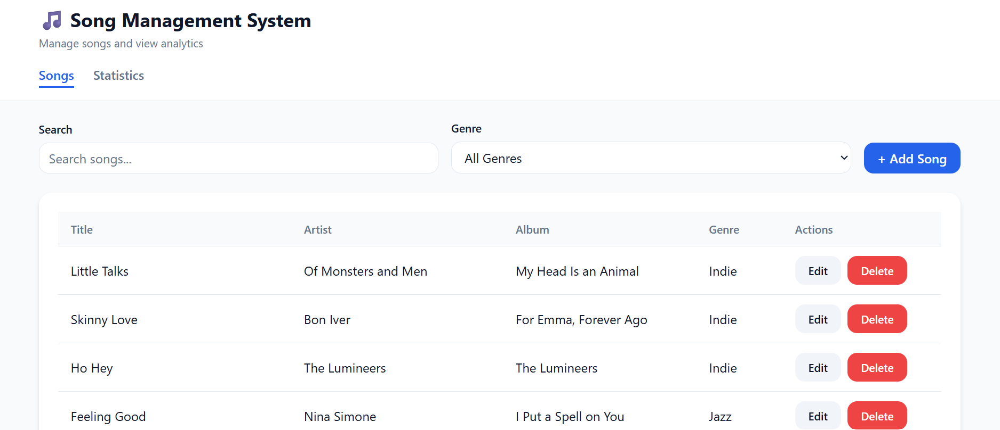
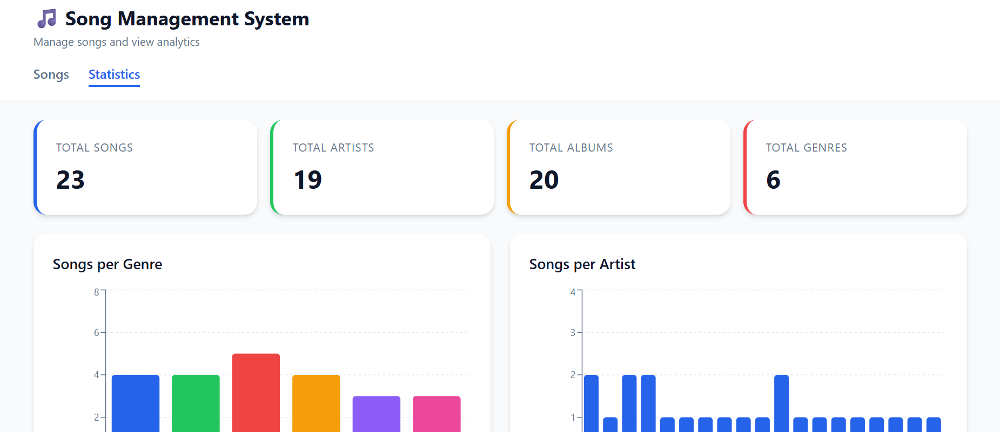
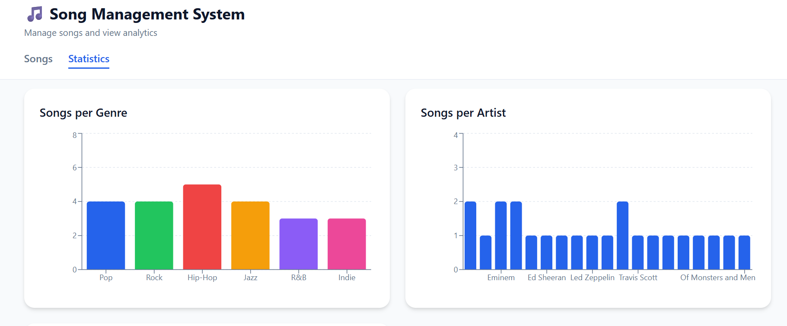

# Song Management System

A full-stack MERN application built for the Addis Software Full Stack Developer Assessment.

## Live Demo

- **Frontend (Vercel)**: https://song-management-system.vercel.app
- **Backend (Render)**: https://song-management-system.onrender.com

## Screenshots





## Features

### Backend

- CRUD operations for songs
- Comprehensive Statistics API including:
  - Total songs, artists, albums, and genres
  - Number of songs per genre
  - Number of songs and albums per artist
  - Number of songs per album
- MongoDB with Mongoose
- Dockerized backend

### Frontend

- Create, update, and delete songs
- Statistics dashboard
- Genre filtering and search
- Redux Toolkit for state management
- Redux Saga for async operations
- TypeScript for type safety
- Responsive UI with Emotion
- Real-time updates without page reload

## Tech Stack

### Backend

- Node.js
- Express.js
- MongoDB
- Mongoose
- Docker

### Frontend

- React
- TypeScript (Strict, no `any` types)
- Redux Toolkit
- Redux Saga
- Emotion (Styled Components)
- Vite
- Recharts (Charts)

## API Endpoints

### Songs
| Method | Endpoint | Description |
|--------|----------|-------------|
| `GET` | `/api/songs` | Get all songs (filter by genre with `?genre=` query parameter) |
| `GET` | `/api/songs/:id` | Get a single song by ID |
| `POST` | `/api/songs` | Create a new song |
| `PUT` | `/api/songs/:id` | Update an existing song |
| `DELETE` | `/api/songs/:id` | Delete a song |

### Statistics
| Method | Endpoint | Description |
|--------|----------|-------------|
| `GET` | `/api/stats` | Get comprehensive statistics |

## Run Locally

### Prerequisites

- Node.js (v18 or later)
- MongoDB (or Docker)

### 1. Clone Repository

```bash
git clone https://github.com/kalkidanzenebe/song-management-system.git
cd song-management
```

### 2. Start Backend

```bash
cd backend
cp .env.example .env
# Option 1: With Docker (includes MongoDB)
docker-compose up

# Option 2: Without Docker (make sure MongoDB is running locally)
npm install
npm run dev
```

Backend will run on: `http://localhost:5000`

### 3. Start Frontend

Open a new terminal:

```bash
cd frontend
npm install
cp .env.example .env
npm run dev
```

Frontend will run on: `http://localhost:5173`

## Environment Variables

### Backend

```env
MONGODB_URI=mongodb://localhost:27017/song-management
PORT=5000
NODE_ENV=development
```

### Frontend

```env
# Local development
VITE_API_URL=http://localhost:5000/api

# For production (Vercel)
VITE_API_URL=https://song-management-system.onrender.com/api
```

## Deployment Guide

### Backend (Render)

1. Push your code to GitHub
2. Create a new Web Service on Render
3. Configure the service:
   - **Root directory**: `backend`
   - **Build command**: `npm install`
   - **Start command**: `npm start`
4. Add environment variables:
   - `MONGODB_URI`: Your MongoDB connection string (use MongoDB Atlas for production)
   - `PORT`: `5000`
   - `NODE_ENV`: `production`

### Frontend (Vercel)

1. Push your code to GitHub
2. Import your repository to Vercel
3. Configure the project:
   - **Root directory**: `frontend`
   - **Build command**: `npm run build`
   - **Output directory**: `dist`
4. Add environment variable:
   - `VITE_API_URL`: `https://song-management-system.onrender.com/api`

## Project Structure

```
song-management/
├── backend/
│   ├── src/
│   │   ├── config/
│   │   │   └── db.js
│   │   ├── controllers/
│   │   ├── middleware/
│   │   ├── models/
│   │   ├── routes/
│   │   ├── services/
│   │   ├── utils/
│   │   ├── app.js
│   │   └── server.js
│   ├── Dockerfile
│   ├── docker-compose.yml
│   └── package.json
└── frontend/
    ├── src/
    │   ├── app/
    │   ├── api/
    │   ├── features/
    │   │   ├── songs/
    │   │   └── stats/
    │   ├── shared/
    │   ├── types/
    │   ├── App.tsx
    │   └── main.tsx
    └── package.json
```
